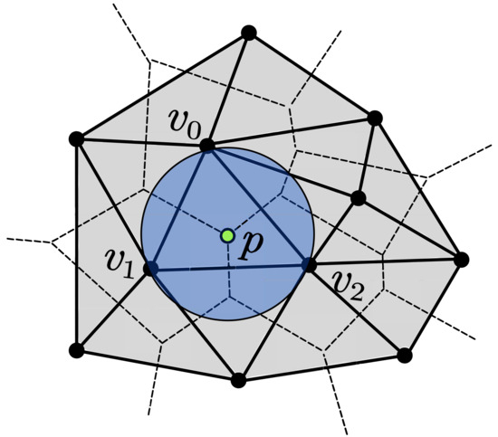
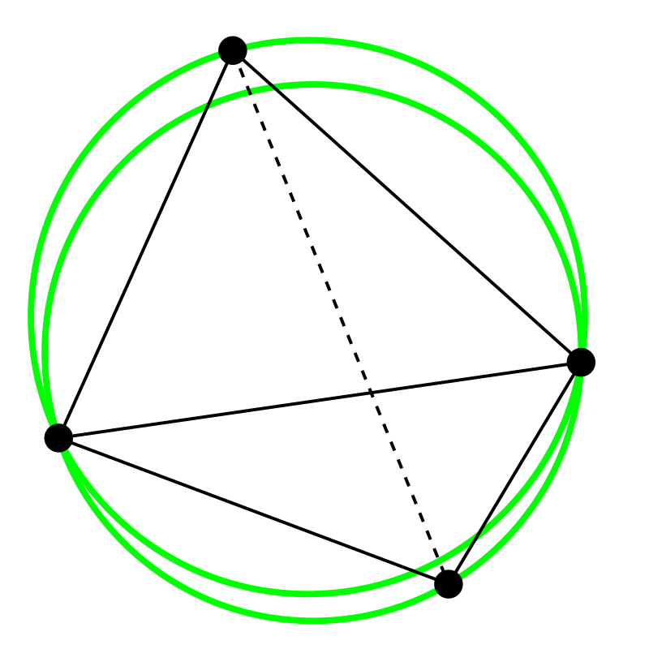
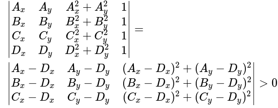

# Progetto Delaunay

Dato un set di punti $P \in \mathbb{R^2}$ trovare la triangolazione che rispetti l'ipotesi di Delaunay, ovvero tale che nessun punto appartenente a P sia interno al circumcerchio di un triangolo della triangolazione.

## Algoritmo

Dato il set di punti P:

* estrarre tre punti non collineari e creare il primo triangolo:
  * estrarre i tre punti in modo che sia massima l'area del triangolo creato. Questo per massimizzare la probabilità che gli altri punti cadano all'interno del triangolo creato;
* per ogni nuovo punto Q:
  * se Q è interno alla triangolazione:
    * localizzare il triangolo T contenente Q;
    * unire il punto Q con i vertici del triangolo T per creare una sottotriangolazione;
  * se Q è esterno alla triangolazione:
    * unire Q con tutti i vertici della triangolazione, trascurando tutti i segmenti che abbiano intersezione con i segmenti della triangolazione;
  * verificare l'ipotesi di Delaunay sulla nuova triangolazione creata. Tale ipotesi risulta verificata se, dati due triangoli adiacenti ABC e BDC, gli angoli opposti al lato di adiacenza BC sommano meno di $180$°. Se questo non accade, eliminando il lato BC e aggiungendo il nuovo lato AD, si producono due nuovi triangoli ADC e ABD che soddisfano l'ipotesi di Delaunay (operazione di "flip");
  

  
## Suggerimenti

* Per ogni triangolo creato è opportuno ordinare i suoi vertici in senso antiorario;
* Durante la creazione della mesh triangolare servirà tenere traccia della adiacenza dei triangoli per potere verificare l'ipotesi di Delaunay;
* Per ricercare i tre punti iniziali che massimizzano l'area occorre utilizzare una struttura dati scelta tra quelle viste durante l'anno, che permetta la ricerca degli elementi in maniera efficiente;
* Durante la creazione della triangolazione, potrebbe essere utile tenere traccia se un punto è interno o di bordo della triangolazione, per migliorare l'efficienza del caso in cui Q sia esterno alla triangolazione;
* Per escludere in modo rapido se un punto è interno ad un triangolo si può prima verificare se tale punto risulta essere esterno al quadrato o al cerchio che circoscrive quel triangolo.
* Un metodo per identificare se un punto D cade all'interno della circonferenza circoscritta ad un triangolo $T_{ABC}$ è quello di valutare se: 

Tale metodo richiede che i vertici siano ordinati in senso antiorario.

Per altri suggerimenti è possibile consultare la pagina: 
https://en.wikipedia.org/wiki/Delaunay_triangulation
